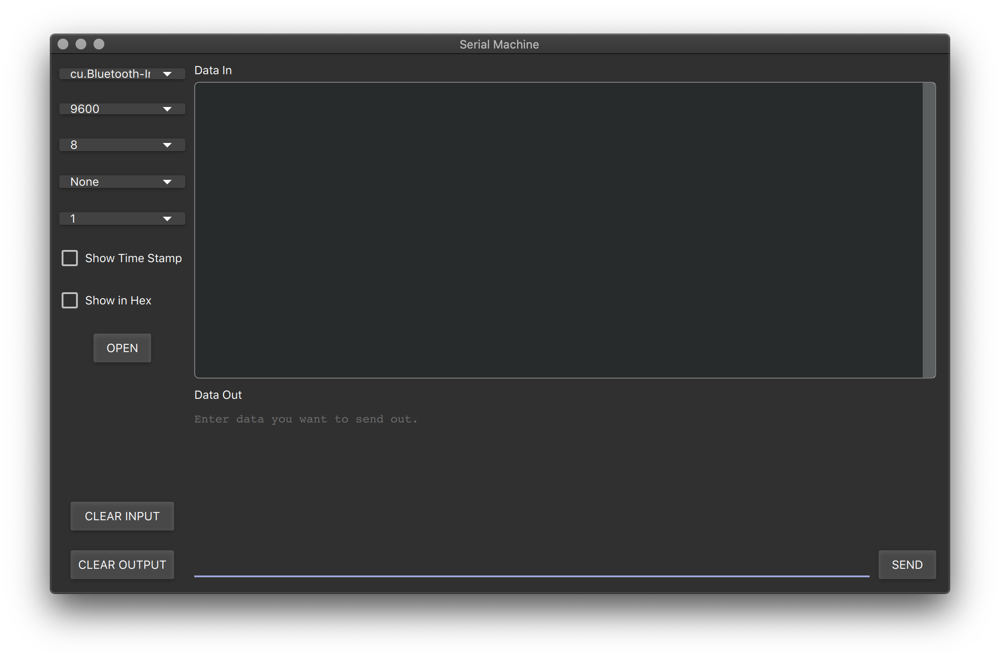

# Serial Machine

[](./README_zh.md) [](./LICENSE)

A Tool used for serial communication in computer, written with Qt Quick. Now only MacOS version can be acessed in release. If you want to run this app in another platform, like Windows, you can try to download this project and compile by yourself.

## Usage

Open Application and set right configurations.



## Build by Yourself

If you want to build the application bundle by yourself, for MacOS, remember to use `-qmldir` option with `macdepolyqt`.

``` zsh
macdeployqt Serial-Machine-Quick.app -qmldir=<path to root qml folder> -no-strip -always-overwrite [-dmg]
```
